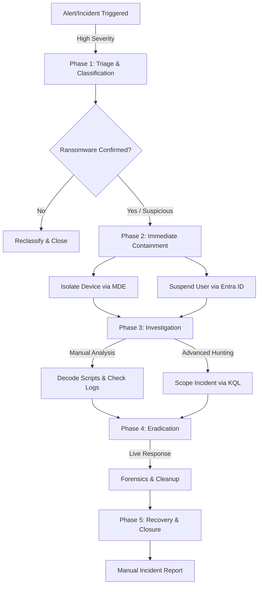

# Standard Operating Procedure (SOP): Ransomware Triage & Remediation (Manual)
**Version:** 1.0  
**Tools:** Microsoft Defender XDR, Microsoft Sentinel, PowerShell, KQL  
**Author:** SOC Team

---

## 1. Purpose
This document defines the standardized workflow for detecting, containing, and eradicating ransomware threats using the Microsoft Unified Security Operations Platform. This workflow relies on manual analysis and standard automation capabilities without Generative AI assistance.

## 2. Process Overview (Workflow)



---

## 3. Phase 1: Triage & Identification

**Objective:** Rapidly confirm if the incident is a true positive ransomware attack.

1.  **Navigate to the Unified Incident Queue** in `security.microsoft.com`.
2.  **Filter** for `Severity: High` and `Category: Ransomware`.
3.  **Review the Incident Graph:**
    * Check for linked entities (Multiple devices often indicate lateral movement).
4.  **Analyze Alert Details:**
    * Open the first alert in the timeline.
    * *Key Indicators:* Look for `vssadmin.exe delete shadows`, `cipher.exe /w`, or processes modifying files in bulk (e.g., `1000+ file modifications in 1 minute`).

> **Decision Point:** If the activity resembles encryption or data exfiltration, proceed immediately to **Phase 2**. Do not wait for full forensic confirmation.

---

## 4. Phase 2: Immediate Containment

**Objective:** Stop the spread. Time is critical.

### 4.1 Device Isolation (Defender for Endpoint)
1.  Go to the **Assets** tab within the Incident.
2.  Select the infected device(s).
3.  Click **Isolate Device**.
    * *Note:* Ensure "Allow Outlook/Teams" is **unchecked** for ransomware scenarios to prevent C2 communication via legitimate channels.
    * *Result:* Device is cut off from the network but remains accessible to the SOC team via Defender.

### 4.2 Identity Suspension (Entra ID / Sentinel)
1.  Identify the compromised user in the **Users** tab.
2.  **Option A (Manual):** Navigate to the user page -> Click **Suspend User**.
3.  **Option B (Sentinel Playbook):** If working in Sentinel, run the `Block-AADUser` playbook against the incident.

---

## 5. Phase 3: Investigation & Analysis

**Objective:** Understand the scope and identifying the entry point (Patient Zero).

### 5.1 Manual Script Analysis
If the timeline shows suspicious PowerShell (e.g., Base64 encoded strings):
1.  Copy the encoded command string from the alert details pane.
2.  **Safe Decoding:** Paste the string into a secure, offline decoding tool (e.g., CyberChef or a local sandbox) to reveal the actual command.
    * *Look for:* `Invoke-WebRequest`, `DownloadString`, or connection attempts to external IPs.

### 5.2 Advanced Hunting (Scope Check)
Use KQL to manually check if the file hash or IP has been seen elsewhere.

```kusto
// Search for the malicious file hash across all devices
DeviceFileEvents
| where SHA256 == "INSERT_MALICIOUS_HASH_HERE"
| where Timestamp > ago(7d)
| project Timestamp, DeviceName, FileName, FolderPath, ActionType

// Search for network connections to the attacker's IP
DeviceNetworkEvents
| where RemoteIP == "INSERT_ATTACKER_IP_HERE"
| where Timestamp > ago(24h)
| project Timestamp, DeviceName, LocalIP, RemoteIP, RemotePort
```

---

## 6. Phase 4: Eradication (Live Response)

**Objective:** Remove malicious artifacts and ensure the machine is clean.

1.  Initiate a **Live Response Session** on the isolated device.
2.  **Upload Tools:** Upload a forensic scanner or removal script if necessary.
3.  **Kill Processes:**
    * Command: `remediate process [ProcessID]` (if AIR hasn't already killed it).
4.  **Collect Evidence:**
    * Command: `getfile "C:\Temp\ransomware_note.txt"` (for analysis).
5.  **Review Action Center:**
    * Check `Action Center` -> `History` to ensure Defender Antivirus has successfully quarantined the primary threat files.

---

## 7. Phase 5: Recovery & Closure

**Objective:** Restore service and document the lesson.

1.  **Verification:** Reboot the machine (via Live Response `shutdown /r`) and verify no malicious processes restart.
2.  **Unisolation:**
    * Only perform this after the machine is confirmed clean or reimaged.
    * Select Device -> **Release from Isolation**.
3.  **Reporting:**
    * Manually document the timeline, root cause (Patient Zero), and actions taken in the ITSM ticket.
    * Include screenshots of the Incident Graph and relevant KQL results.
4.  **Post-Incident Review:**
    * Update **Watchlists** in Sentinel with any new IOCs (Indicators of Compromise).
    * Close Incident in Defender:
        * **Classification:** True Positive.
        * **Determination:** Ransomware.
